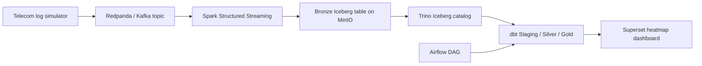

# OneHouse Architecture

## End-to-end flow

## Component roles

| Layer | Component | Role |
| --- | --- | --- |
| Ingestion | Redpanda | Kafka-compatible event broker. |
| Ingestion | Simulator | Emits CDR and mobile data events continuously. |
| Processing | Spark | Parses Kafka JSON, de-duplicates events, writes Bronze Iceberg. |
| Storage | MinIO | S3-compatible object storage for Iceberg data and metadata files. |
| Catalog | Iceberg REST | Metadata catalog shared by Spark and Trino. |
| Compute | Trino | SQL query engine used by dbt and Superset. |
| Transformation | dbt | Code-based ELT, tests, docs, lineage. |
| Orchestration | Airflow | Runs dbt seed/run/test/docs every 15 minutes. |
| Serving | Superset | Dashboard and heatmap visualizations. |

## Medallion layers

Bronze is append-only and preserves audit fields such as `raw_payload`,
`kafka_timestamp`, and `ingested_at`.

Silver applies technical quality rules: event de-duplication, basic domain
filters, and BTS metadata enrichment.

Gold computes dashboard-ready KPIs in 15-minute windows, using an incremental dbt
model keyed by `window_start` and `cell_id`.
