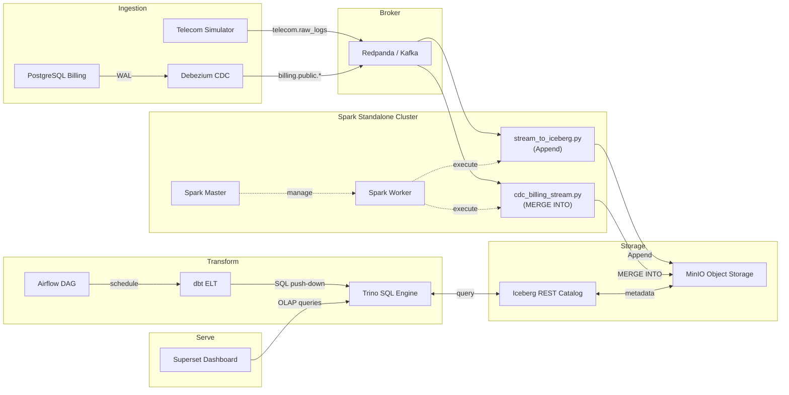
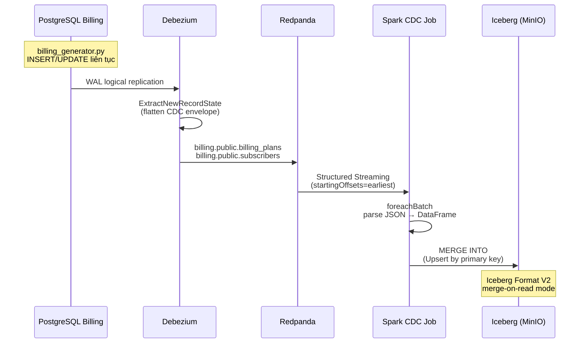

# Kiến trúc Hệ thống OneHouse

## Sơ đồ luồng dữ liệu đầu cuối



## Vai trò các thành phần

| Tầng | Thành phần | Vai trò |
|------|-----------|---------|
| Ingestion | Redpanda | Message broker tương thích Kafka, tiếp nhận events từ simulator và Debezium |
| Ingestion | Telecom Simulator | Sinh liên tục CDR và log Internet di động 4G/5G |
| CDC | PostgreSQL Billing | CSDL OLTP chứa gói cước và thuê bao, WAL logical replication |
| CDC | Debezium | Kafka Connect đọc WAL, chuyển đổi thành CDC events, flatten qua ExtractNewRecordState |
| CDC | Billing Generator | Sinh liên tục INSERT/UPDATE mô phỏng nghiệp vụ thanh toán |
| Processing | Spark Master | Quản lý Spark Standalone Cluster (custom image, pre-baked JARs) |
| Processing | Spark Worker | Thực thi tasks tính toán |
| Processing | Spark Streaming | Job #1: Parse Kafka JSON, khử trùng lặp, Append Iceberg bronze |
| Processing | Spark CDC | Job #2: foreachBatch + MERGE INTO (Upsert) cho CDC billing data |
| Storage | MinIO | Object Storage S3-compatible lưu trữ Iceberg data files (Parquet) |
| Catalog | Iceberg REST | Metadata catalog chia sẻ giữa Spark và Trino, loại bỏ Hive Metastore lock |
| Compute | Trino | MPP SQL Engine cho truy vấn OLAP sub-second |
| Transform | dbt | ELT code-based: staging → silver → gold, tests, docs, lineage |
| Orchestrate | Airflow | Lập lịch dbt mỗi 15 phút, quality gates ngắt mạch khi test fail |
| Visualize | Superset | Dashboard bản đồ nhiệt giám sát mạng viễn thông |

## Medallion Architecture

### Bronze (Dữ liệu thô)
- **Telemetry**: `viettel.bronze.telecom_events` — Append-only, phân vùng theo `days(event_ts), network_type`. Giữ nguyên `raw_payload`, `kafka_timestamp`, `ingested_at` cho audit.
- **CDC**: `viettel.bronze.billing_plans` và `viettel.bronze.subscribers` — MERGE INTO (Upsert), Iceberg Format V2 với merge-on-read mode. Xử lý soft-delete qua cờ `is_deleted`.

### Staging (Chuẩn hóa)
- `stg_telecom_events`: View ép kiểu, chuẩn hóa case, tính `total_mb`, `is_call_failure`, `has_qoe_issue`
- `stg_billing_plans`: View lọc soft-delete, chuẩn hóa `plan_type`
- `stg_subscribers`: View lọc soft-delete, uppercase `home_cell_id` cho JOIN tương thích BTS metadata

### Silver (Làm sạch & Làm giàu)
- `silver_cell_events`: Khử trùng lặp bằng `event_id`, JOIN metadata BTS → thêm tỉnh, huyện, toạ độ, vendor, capacity

### Gold (KPI & Analytics)
- `gold_network_kpis`: Incremental MERGE, cửa sổ 15 phút, tổng hợp theo `cell_id + network_type`
- `gold_cell_heatmap`: View latest-per-cell, phân loại severity (NORMAL/WARNING/CRITICAL)
- `gold_customer_360`: Cross-domain JOIN (billing × telemetry), tính `customer_impact_score`, phân loại `churn_risk_tier`
- `gold_plan_revenue_impact`: Tổng hợp theo gói cước, tính `revenue_at_risk_pct`, phân loại `plan_health_status`

## Spark Cluster Architecture

```
┌─────────────────────────────────────────┐
│           Spark Master (:7077)          │
│           Web UI (:8085)               │
└───────────────┬─────────────────────────┘
                │ register
┌───────────────▼─────────────────────────┐
│           Spark Worker                  │
│           Web UI (:8086)               │
│   cores: ${SPARK_WORKER_CORES:-2}      │
│   memory: ${SPARK_WORKER_MEMORY:-2g}   │
└───────────────┬─────────────────────────┘
                │ execute
    ┌───────────┴──────────────┐
    ▼                          ▼
┌──────────────┐    ┌──────────────────┐
│ spark-submit │    │ spark-submit     │
│ Job #1:      │    │ Job #2:          │
│ Telemetry    │    │ CDC Billing      │
│ (Append)     │    │ (MERGE INTO)     │
│ UI: :4040    │    │                  │
└──────────────┘    └──────────────────┘
```

- **Custom Image**: `python:3.12-slim-bookworm` + Java 17 + Spark 3.5.3
- **Pre-baked JARs**: Iceberg 1.7.1 runtime + AWS bundle, Kafka connector, commons-pool2
- **Entrypoint**: Multi-mode (`SPARK_MODE`: master/worker/submit), catalog configurable via `$ICEBERG_CATALOG`
- **Checkpoints**: Lưu trên MinIO S3 (`s3a://warehouse/checkpoints/`) thay vì Docker volume local

## CDC Pipeline Architecture



**Xử lý DELETE**: Debezium dùng `delete.handling.mode: rewrite` → thêm cột `__deleted`. Spark chuyển thành `is_deleted` boolean. dbt staging views lọc `WHERE is_deleted = false`.
